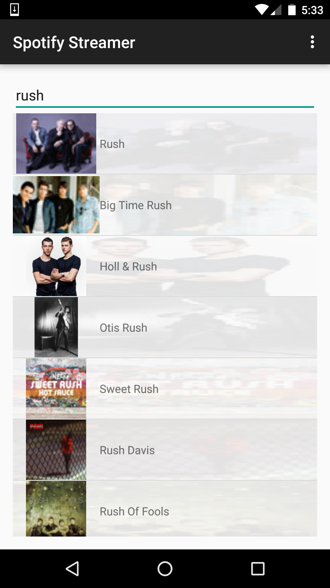
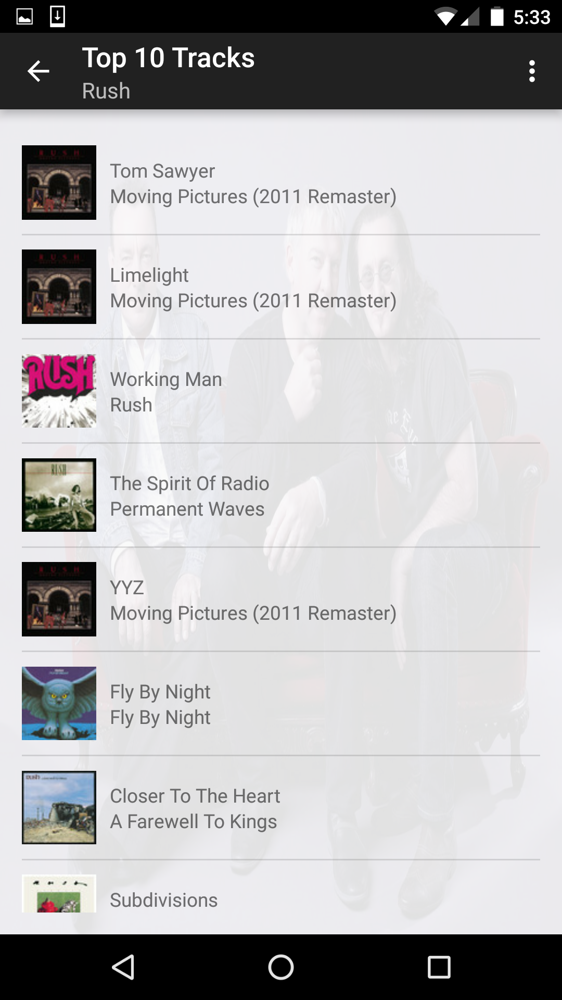
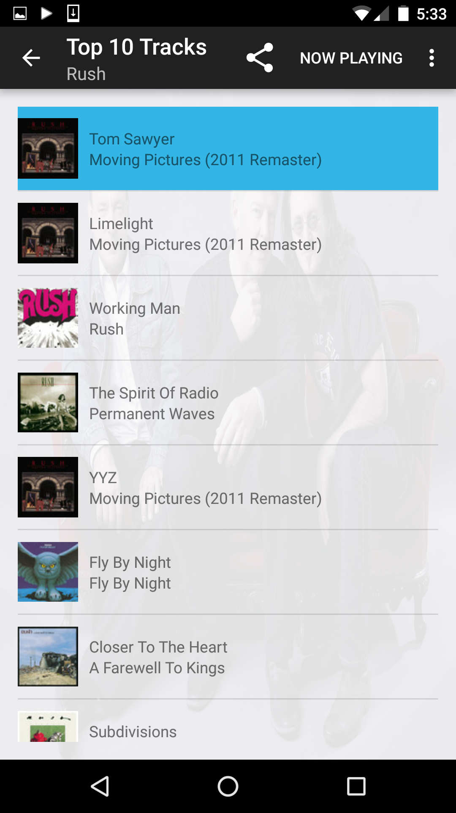
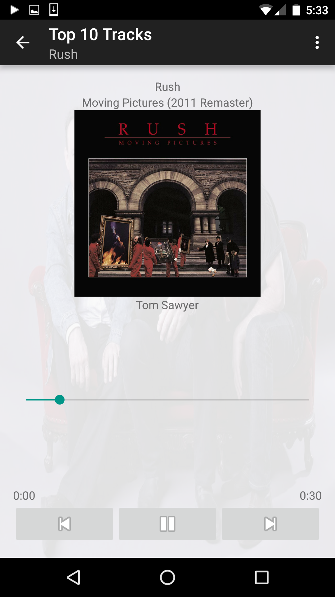
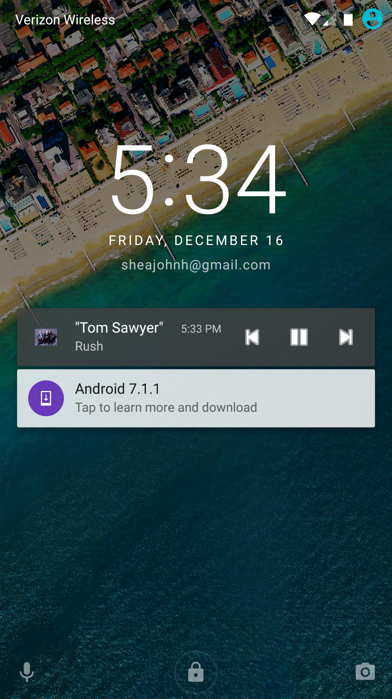
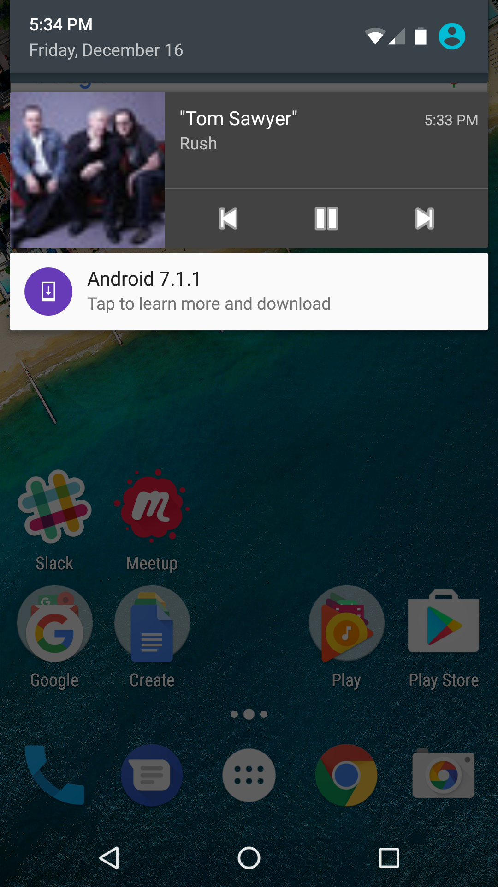
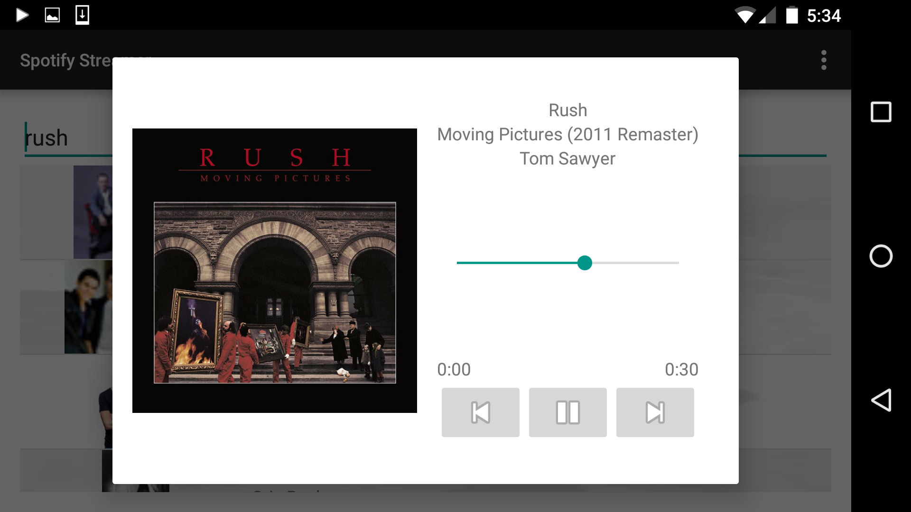

# Spotify Streamer

## Udacity Android Developer Nanodegree

### Project 1 & Project 2

Android mobile app that allows users to search and stream music.

- Received “Exceeded Expectations” by reviewer

#### Functionality

The interface allows users to search for musical artists, displays the artist's album artwork, and streams their Top 10 tracks from Spotify.

#### Android App Components Used
- Fragments (for phone/tablet layouts, custom DialogFragment)
- Service
- LocalBroadcastManager
- Notifications (Also displayed on lock screen with navigation controls)
- ShareActionProvider
- Thread class
- AsyncTask
- SharedPreferences
- ActionBar buttons
- MediaPlayer class

#### Libraries and APIs Used
- Picasso library
- Spotify API

### Screenshots

